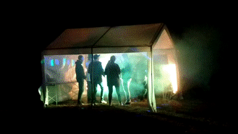

sound-to-light-osc
==================

Real-time detection of beats with Python from an audio input device (typically "Stereo Mix"). Outputs OSC signals,
to be used for sound-to-light control.

It keeps track of the music "intensity" (calm, normal, intense) to switch lighting programs.

I use [QLC+](https://github.com/mcallegari/qlcplus) for DMX control.

Required modules
----------------

- PyAudio
- PyQt5
- PyQwt
- matplotlib
- scipy
- python-osc

Usage
-----

`python beatDetector.py`

OSC Signals
-----------

OSC signals are sent to `localhost:7701`, can be changed in `beatDetector.py`.

- `/beat` is sent for every beat detected.
- `/bar` is sent every to change the lighting scene.
- `/prog1` - `/prog8` is sent to change lighting programs (available have to be configured in `beatDetector.py`)

Acknowledgments
---------------

Based on [shunfu/python-beat-detector](https://github.com/shunfu/python-beat-detector).

Version History
---------------

### 1.0

- Beat detection
- Automatic beat generation based on BPM
- Pause and new song detection

### 1.1

- Improved max volume calibration
- Improved pause detection
- Intensity detection
- Automatic lighting program switch

Support Me
----------
I love to hear from people using my work, it's giving me the motivation to keep working on it.

If you want to let me know you're finding it useful, please consider giving it a star ⭐ on GitHub.

If you love my work and want to say thank you, you can help me out for a beer 🍻️
[via PayPal](https://paypal.me/ChristianScheb).
